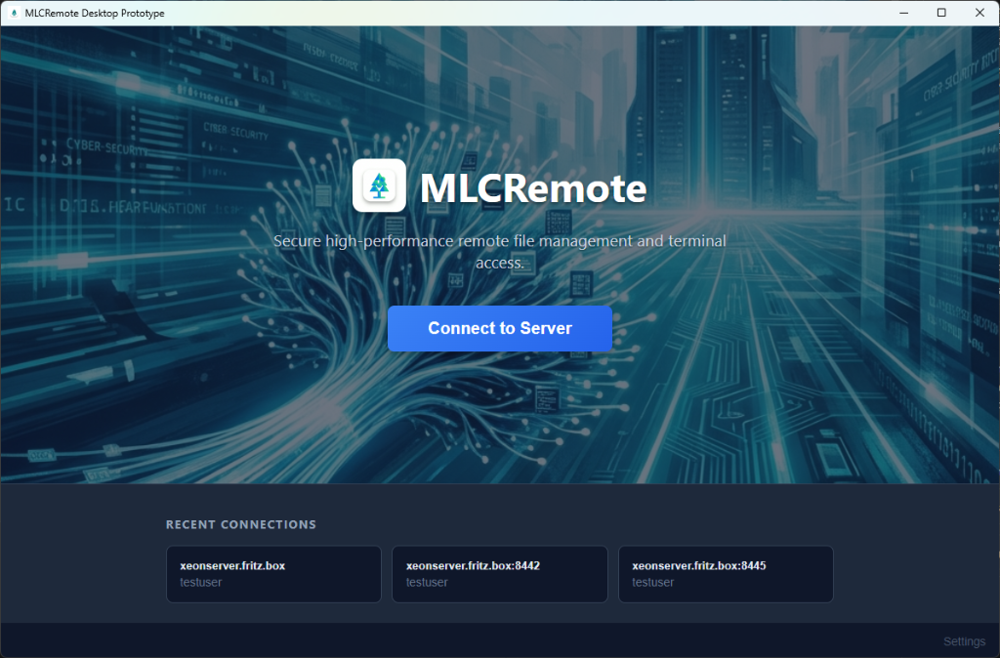
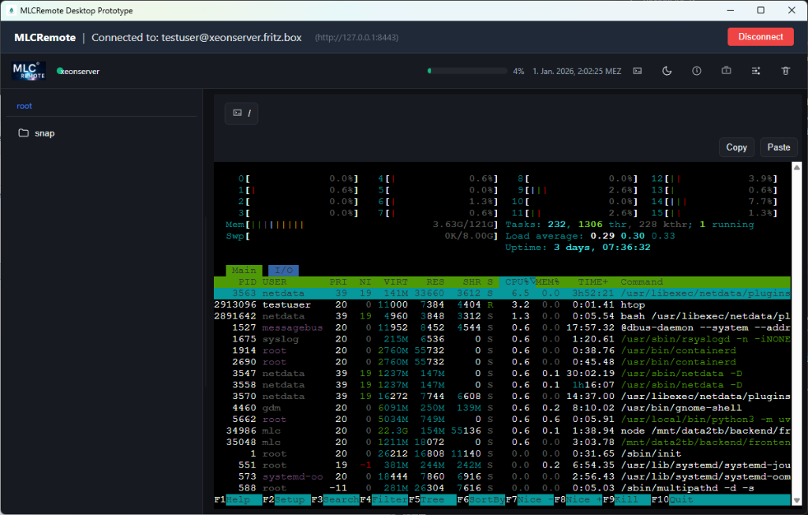

MLCRemote — Desktop
===================

Lightweight remote development environment for small servers, wrapped in a native desktop application.

**Status:** Production Ready (v1.2.2)

## Features

-   **Native Desktop App:** Windows, macOS, and Linux support via Wails.
-   **Zero-Setup Remote:** Automatically deploys a standalone Golang binary to the remote server.
-   **SSH Tunneling:** Securely connects via SSH tunnels; no open ports required on the remote.
-   **Rich File Manager:**
    -   Drag & Drop Upload
    -   Context Menu (Download, Delete, Copy Path)
    -   Trash Support (Safety first!)
    - **Modern UI:** Optional VSCode-like interface with sidebar navigation and tab management.
- **File Management:** Browse, edit, delete, and move files on remote servers.
- **Terminal:** Integrated SSH terminal with multiple tabs. PTY support with resize handling and correct encoding.
-   **Profile Manager:**
    -   **Tabbed Interface:** Organized settings for General, Extended (Default Shell), and Quick Jobs.
    -   **Quick Jobs:** Define server-side tasks/scripts that can be executed with one click.
    -   Save connection details with color-coding
    -   Duplicate profile detection
    -   Metadata tracking (OS/Arch/Version, Last Seen)
-   **Workspace Persistence:** Remembers open files and layout per server profile.
-   **Split View:** Multi-pane editor support.
-   **Smart Launch UI:** Futuristic "Blueprint" design with connection locking and state feedback.
-   **Graceful Shutdown:** Safely closes tunnels and connections on exit.

## Screenshots

<p align="center">
  
  
</p>
<p align="center">
  
  
</p>

## Quick Start (Desktop) - **Recommended**

> [!IMPORTANT]
> **Windows Users:** Please use the pre-built installer (`MLCRemote-amd64-installer.exe`) available in the [Releases](https://github.com/mlechner911/mlcremote/releases) section or the `dist/` folder.
> Building from source is **not required** and is intended for contributors only.

1.  **Download** the latest installer for your OS (Windows).
2.  **Run** the installer and launch the application.
3.  **Connect** to your server:
    -   Enter `User` (e.g., `root` or `ubuntu`) and `Host` (IP or domain).
    -   **Authentication:**
        -   **Managed Identity:** (Recommended) Let the app manage a secure key for you.
        -   **System Agent:** Use your local SSH agent or default keys (`~/.ssh/id_rsa`).
        -   **Custom Key:** Select a specific `.pem` or key file.
    -   Click **Connect**. The app will automatically check for the backend and install/update it if needed.

## Development

**Prerequisites:**

 -   Go 1.24+ (required for backend/desktop modules)
 -   Node.js 20+
 -   Wails CLI (`go install github.com/wailsapp/wails/v2/cmd/wails@latest`)
 -   **Task** (Build System): `go install github.com/go-task/task/v3/cmd/task@latest`
 -   Docker (Required for Linux cross-compilation)
 -   NSIS (Windows: For installer build)

 **Local Build & Run:**

 ```bash
 # See available targets
 task help

 # Full Desktop Build (Dev Mode with Hot Reload)
 task dev

 # Create Production Bundle (Windows)
 task dist

 # Create Full Release (Installer + Linux binary)
 task release
 ```

 *For detailed build documentation, see [BUILD.md](docs/BUILD.md).*

**Docker Development:**

For a fully isolated environment (recommended for testing backend changes):

```bash
task docker:dev
```
*See [DOCKER.md](DOCKER.md) for details.*

**Manual Build Components:**

-   **Backend (Linux):**
    ```bash
    GOOS=linux GOARCH=amd64 go build -o bin/dev-server ./backend/cmd/dev-server
    ```
-   **Frontend:**
    ```bash
    cd frontend && npm install && npm run build
    ```

**Architecture:**

-   **Backend (Remote):** A single static Go binary (`dev-server`) providing API + PTY.
-   **Frontend (UI):** React + Vite SPA, served locally by the desktop app.
-   **Desktop (Local):** Wails (Go) application handling SSH tunnels, window management, and native integration.

## Security

### Managed SSH Keys
When using "Managed Identity", the application generates a **passwordless** Ed25519 SSH key pair stored securely in your OS user's configuration directory (`~/.config/MLCRemote/keys/` or `%APPDATA%\MLCRemote\keys\`).

**Why no passphrase?**
This key is designed for automated, seamless background connection to your remote server. Requiring a passphrase would interrupt the connection flow every time you launch the app or reconnect. Since the key is generated with strict file permissions (0600) and stored in your user profile, it effectively inherits the security of your OS login.

For higher security environments, we recommend configuring **SSH Key Restrictions** to limit what this key can do (see [SSH Security Setup](docs/SSH_SECURITY_SETUP.md)).

## License

MIT — Michael Lechner


