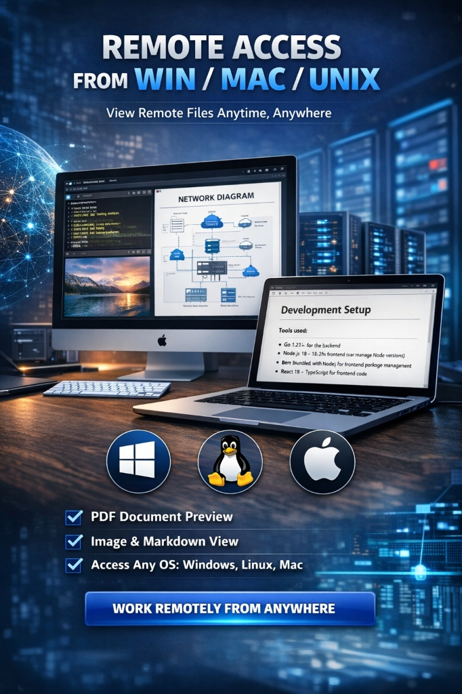
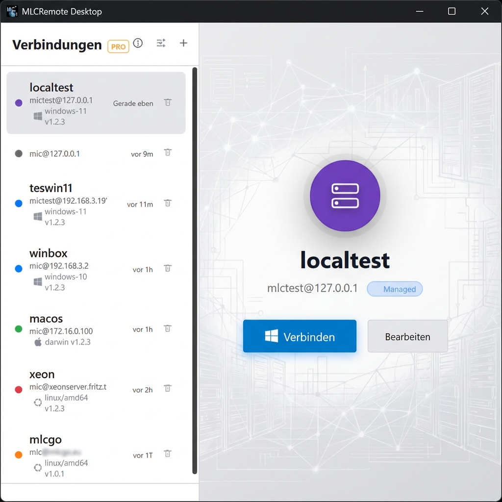
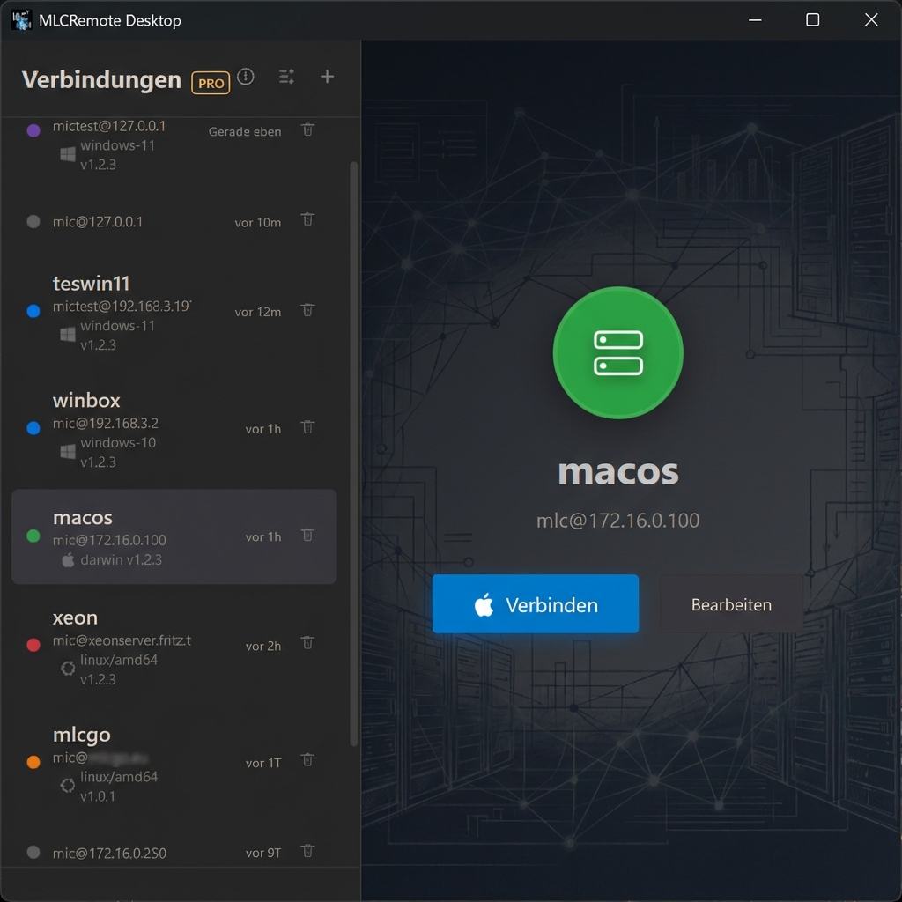
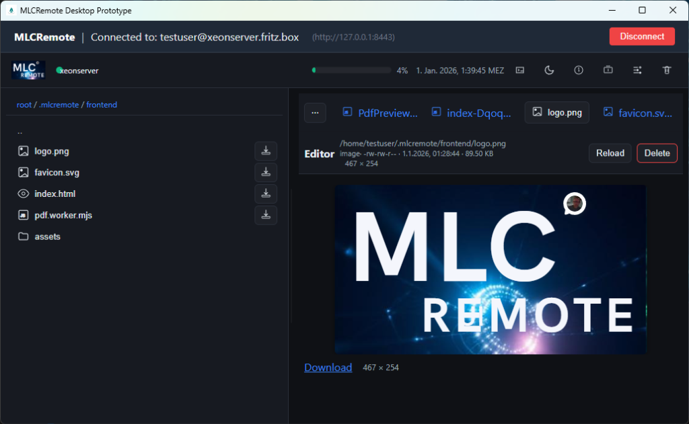

<div align="center">
  <h3>Access Any System, Anywhere.</h3>
  <p>
    <b>The All-in-One open-source Remote Development/System Administration environment.</b><br>
    Connect to Linux, Windows, or Mac from a native desktop application.<br>
    No complex setup. No monthly fees. Just code.
  </p>
  <p>
    <a href="https://github.com/mlechner911/mlcremote/releases"><b>Download for Windows</b></a> • 
    <a href="docs/USER_GUIDE_EN.md">User Guide</a> • 
    <a href="CONTRIBUTING.md">Developer Guide</a>
  </p>
  <br>
</div>

**Status:** Production Ready (v1.3.0)

## Why MLCRemote?

We believe remote management should be **visual, fast, and free**.
Most remote tools are either expensive SaaS subscriptions or complex command-line utilities, a lot
are also unusable for small VPS or home servers.

**MLCRemote** bridges this gap:
*   **Open Source (MIT):** Free to use for personal and commercial projects.
*   **Zero-Setup:** It deploys itself. You just need SSH access.
*   **Extremely Lightweight:** The remote agent is a single binary (~10MB) requiring **< 20MB RAM**. Perfect for Raspberry Pis and small VPS.
*   **Cross-Platform:** Connect *from* Windows/Mac/Linux *to* Windows/Mac/Linux.

## Features at a Glance

|   |   |
|---|---|
| **🚀 Instant Access** | Connect to any server in seconds. The app automatically deploys a lightweight, static Go binary to handle all operations. |
| **📁 Rich File Manager** | Drag & Drop uploads, context menus, trash support, and full file operations (Copy/Move/Delete). |
| **💻 Terminal & PTY** | Integrated, resize-aware SSH terminal with multiple tabs and full encoding support. |
| **� Admin Tools** | Monitor system health, manage processes (HTOP style), and execute one-click maintenance scripts via Quick Jobs. |
| **�🖼️ Media Preview** | View images, PDFs, Markdown, Videos, and Code directly in the remote file manager. |
| **🔒 Secure Tunneling** | All traffic flows through a secure SSH tunnel. No extra ports need to be opened on your firewall. |
| **⚡ Smart Workflow** | Persistent workspace state, split-view editing, and rapid-fire navigation. |

## Documentation

- 📘 [User Guide (English)](docs/USER_GUIDE_EN.md)
- 📙 [Benutzerhandbuch (Deutsch)](docs/USER_GUIDE_DE.md)
- 🛠️ [Developer Guide (Contributing)](CONTRIBUTING.md)

## Screenshots

<p align="center">
  
  
</p>
<p align="center">
  
  
</p>

## Quick Start (Windows)

1.  **Download** the latest installer (`MLCRemote-setup.exe`) from [Releases](https://github.com/mlechner911/mlcremote/releases).
2.  **Run** the installer.
3.  **Connect**: Enter your Host IP and User.
    *   *Tip: Use "Managed Identity" for a seamless, password-less experience.*

That's it. The app handles the rest.


## macOS & Linux Users

> [!NOTE]
> **Pre-built installers for macOS and Linux are coming soon.**

Currently, you need to **build from source**.
1.  Ensure you have **Go 1.24+**, **Node.js 20+**, and the **Wails CLI** installed.
2.  Follow the [Developer Guide](CONTRIBUTING.md) to build:
    ```bash
    # Build for your platform
    task dist
    ```
    The binary will be created in the `dist/` directory.

### Headless Development (Remote Linux)
If you are developing on a remote Linux machine without a display, you can use `xvfb` to simulate a display server:

```bash
# Install xvfb
sudo apt install xvfb

# Run with virtual framebuffer
task dev:headless
```

> **Tip (VS Code / Remote SSH):**
> If you are running `task dev` remotely and accessing the web UI locally, you must **forward port 8443** (or your configured local port) from the remote machine to your local machine.
> The frontend running in your local browser tries to connect to `localhost:8443`, which must map to the active tunnel on the remote server.

## Security

MLCRemote prioritizes security:
*   **Zero-Trust:** We don't store your passwords.
*   **Managed Keys:** We generate standard Ed25519 keys stored in your OS's secure profile.
*   **Sandboxed:** The remote agent runs as a standard user process.

See [SSH Security Setup](docs/SSH_SECURITY_SETUP.md) for hardening guides.

## License

MIT © Michael Lechner.

Free and Open Source Software. You can use, modify, and distribute this software freely.


